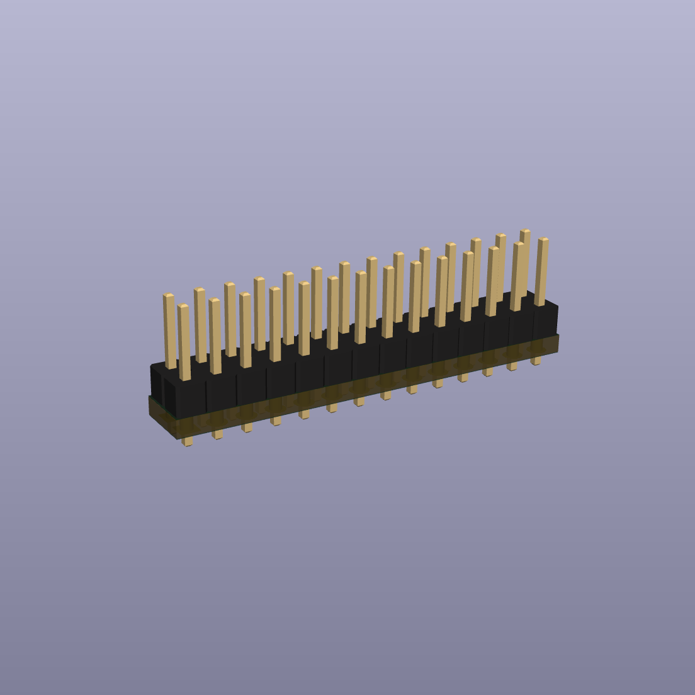
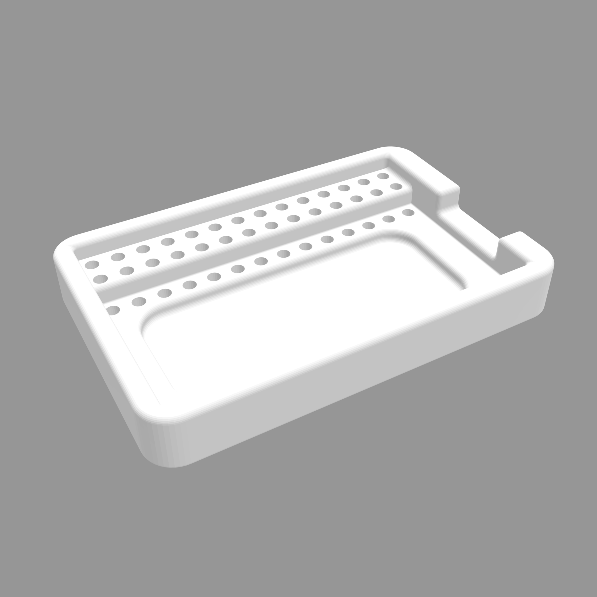
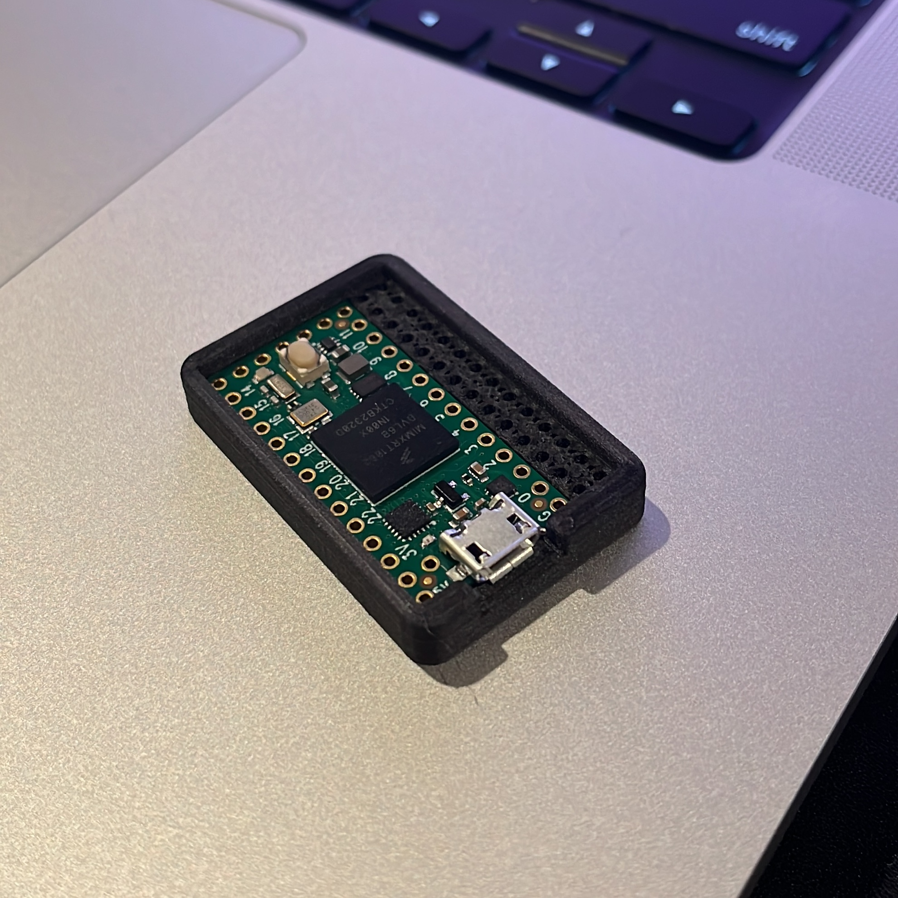

# Teensy 4.0 PWM pcb

This repository holds the KiCad files for an abismally simple pcb design meant for carrying ground and power to servos or bldc speed controllers using a 3 female pin (Futaba J) connector. The signal is meant to come from a microcontroller immediately next to the pcb - a 3d printed holder is included for this.

This design makes it cheap and easy to control many servo motors and run other control programs on the microcontroller. This is intended for use in robotics projects.

## What is PWM

pulse width modulation means switching a voltage on and off to imitate a continuous analog signal. PWM was developed with some specifications, but has been iterated upon for lower latency in protocols like Dshot and Multishot, popular in the quadcopter drone industry. 

## What is a PCB

printed circuit board

## Why use a PCB

connecting the ground and Vin signal can be done by bending extra long headers and soldering them together, but this takes a bit longer while using more space.

# KiCad

The pcb files here were made with [KiCad](https://www.kicad.org). 

Here are my notes on using KiCad