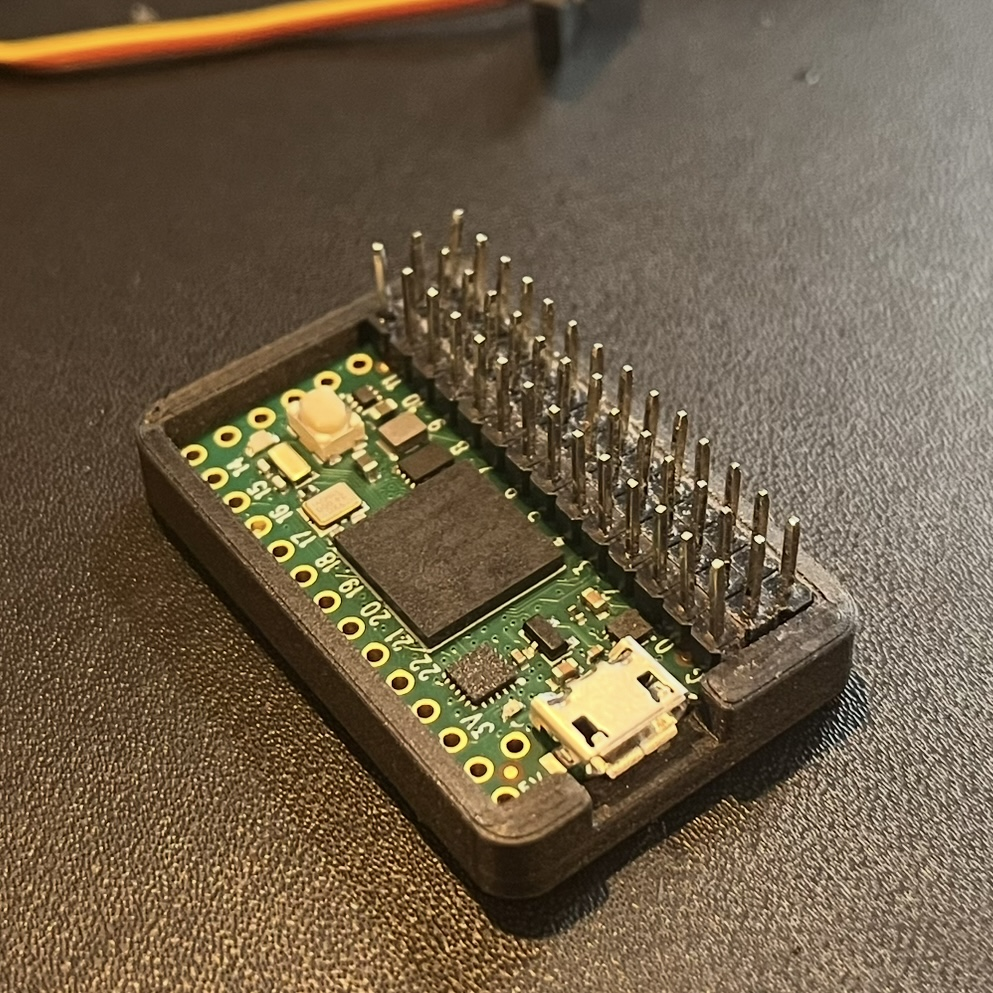
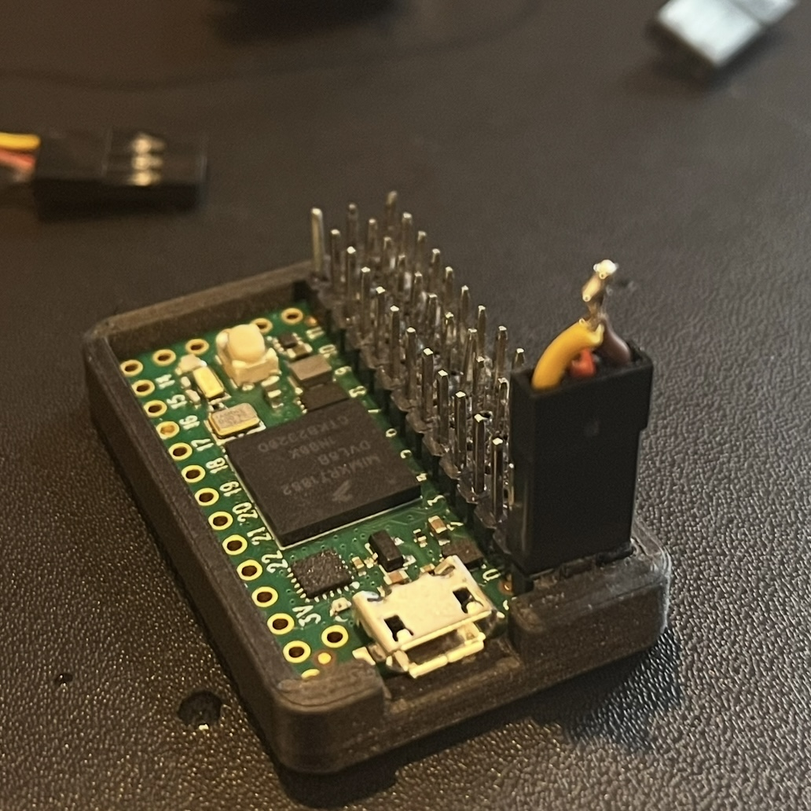

# Teensy 4.0 PWM pcb

**My go-to board for servo motor and ESC control** 
This compact PCB design and 3dprinted mount brings power rails parallel to your teensy 4.0 microcontroller. Any 3-pin Futaba J connector can plug right into your teensy. Intended for use in robotics projects.

## Usage

materials:
- `The teensy 4.0`
- `3d printed mount`
- `pcb`
- `power source`
- `Futaba J connectors`

### 1. Solder the pcb to two rows of headers.

### 2. Print the mount.

Because its small you might have to adjust the tolerances for your printerto fit the teensy.

### 3. Solder one row of headers to the teensy. Make sure to do it on the right side of the teensy.

### 4. Put the teensy and pcb in the mount.

You might have to sand down the headers depending on the accuracy of your print.

### 5. Connect ground on the pcb to the ground on the teensy.

### 6. Add your power source to any set of pins on the teensy, connect your motors, and try out some pwm control.
You can get started with the included `sketch.ino` file. You'll need to [set up your teensy](https://www.pjrc.com/teensy/teensyduino.html) and install the [PWMservo](https://www.pjrc.com/teensy/td_libs_Servo.html) library. Check out the result in test.mp4.

## Teensy 4.0

The [teensy 4.0](https://www.pjrc.com/store/teensy40.html) is a powerful microcontroller that can be used to control servos, ESCs, and other devices that require a pulse width modulated signal. 

## Why use a PCB

Sure, you ***could*** bend long headers and solder everything by hand, but that’s time-consuming and error-prone.

The pcb files were made with [KiCad](https://www.kicad.org) and exported to gerber files for [JLCPCB](https://jlcpcb.com).

## 3d Printed Mount 

The print needs high accuracy because this setup is so compact. Its smaller than most RC gyro units. 

## PWM 

pwm can be used to control servos, ESCs, and other devices that require a pulse width modulated signal.

[pwm](https://en.wikipedia.org/wiki/Pulse-width_modulation)
